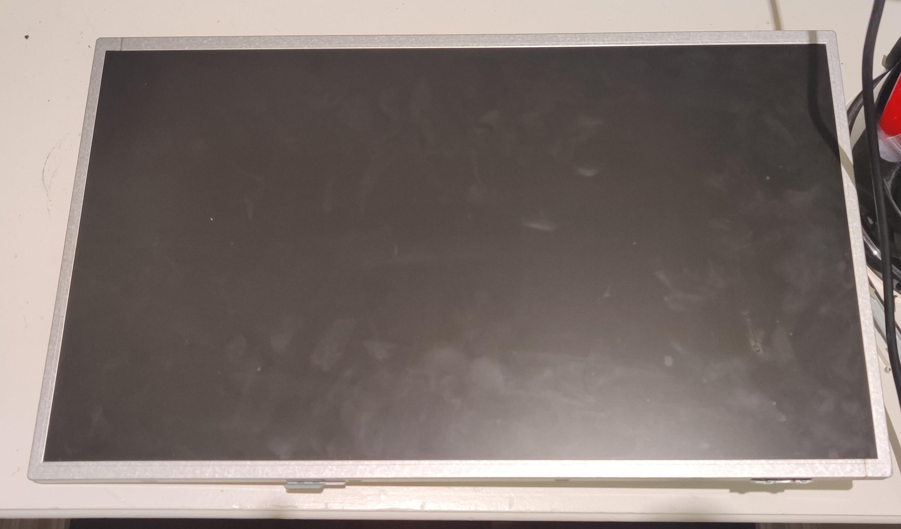

# Smart-Mirror

### This project journal is meant to track my progress building out a smart mirror  
 

### Prior to assembling the mirror I decided to layout all the parts so I could visualize how everything would fit together.

### Starting with a raspberry Pi all the components I used were the Pi itself, a power adapter, sd card and HDMI cable.

### After connecting the Raspberry Pi to a monitor and flashings Rasbian OS onto the sd next was to install MagicMirror². To do this I just used the provided documentation and with a series of commands in terminal the software was installed. Using the third party modules made by users I was able to customize the mirror to add Spotify, google calendar and a crypto chart.

### To create the mirror effect a solid object must be placed behind the two glass. I took the LCD out of a monitor to act as this solid backing while allowing the magic mirror software to shine through.

### To house the whole mirror I got a 2x4x8 and cut out pieces to create a frame.

### To keep components from falling out the front I cut four pieces of trim with 45 degree angles that add a .5 inch overhang to hold everything tight together.

### Next step was assembling the frame with wood screws and dry fitting it with the monitor to make sure the size was correct.

### After nailing the frame in I used a sharp point to slightly recess the nail hole which was then filled with wood filler and sanded it down.

### After completing the frame I used three coats of a wood stain to achieve the colour I wanted.

### After assembling the frame I was able to get a custom piece of 3mm glass cut. This brought the project together really well as I didn't need to work around the unique measurements of my components and just get exactly what I needed made.

### To complete the two-way class I used a reflective privacy filter. Attaching it the glass with an included adhesive left a mirror that was semi transparent when exposed to light.

### After fitting everything within the frame I screwed in two additional brackets to keep the monitor and mirror properly set within the frame.

### The next step was to assemble the mirror leaving me with a final product that combines the reliable functionality of a mirror with modern information to enhance the experience.